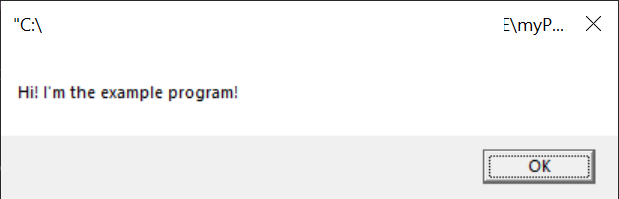

# Motivation

* learn PE format
* learn PE loader common steps
* asm and cpp practice

# Description

```myPEloader.exe``` is a simple loader for ridiculously easy ```SIMPLE_PE.exe```.
```SIMPLE_PE.exe``` compiled in fasm from ```SIMPLE_PE.ASM```, which purpose is 
 to invoke MessageBox consuming minimal resources. Thus, ```SIMPLE_PE.exe```
 contains only three sections ```.text```, ```.idata```, ```.reloc``` and imports 
 one function from ```KERNEL32.DLL``` and two functions from ```USER32.DLL```.
 Perfect sample to learn PE format. I didn't use ```winnt.h``` by design because
 I wanted inspect PE struct offsets in detail.
 
 # Algorithm

```myPEloader.exe``` allocates 4MB memory in its own space, load
DOS Header and sections of ```SIMPLE_PE.exe```, edits import and 
relocation tables and pass control to the entry point. So, 
message box appears.
 
# Usage example
```
C:\PE_loader\myPE>myPE.exe
SIMPLE_PE.EXE new image Base: 0x2900000
Load dos header
Load sections
Edit import table
Edit relloc table
Give exec control to the entry point
```

